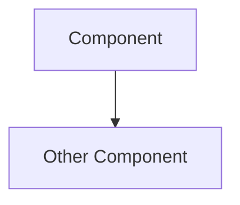

# documentation-validation

## Validation workflow

### Step 1 — Run docuchango

```bash
docuchango validate --verbose
```

### Step 2 — Auto-fix where possible

```bash
docuchango fix
```

Auto-fixes: UUID normalisation, missing dates, broken internal links, status normalisation.

### Step 3 — Fix remaining issues manually

Common issues and fixes:

| Error | Fix |
|---|---|
| Missing `doc_uuid` | `python3 -c "import uuid; print(uuid.uuid4())"` |
| Invalid status | Must be one of: `Draft`, `Proposed`, `Accepted`, `Implemented`, `Superseded`, `Rejected` |
| Invalid date | Must be `YYYY-MM-DD` format |
| Broken link | Use full filename with extension |
| Missing required section | Add the section (see templates below) |

## Required frontmatter

All documents in `docs-cms/`:

```yaml
---
title: 'RFC-NNN: Short Title'
status: Draft          # Draft | Proposed | Accepted | Implemented | Superseded | Rejected
author: Engineering Team
created: YYYY-MM-DDT00:00:00Z
updated: YYYY-MM-DDT00:00:00Z
tags: [tag1, tag2]
id: rfc-NNN
project_id: hermit
doc_uuid: <uuid-v4>
target_audience: [engineering]
related_rfcs: []
related_memos: []
---
```

## Naming conventions

| Type | Pattern |
|---|---|
| RFC | `rfc-NNN-short-kebab-case.md` |
| ADR | `adr-NNN-short-kebab-case.md` |
| Memo | `memo-NNN-short-kebab-case.md` |
| PRD | `prd-NNN-short-kebab-case.md` |

## Diagram requirements

All architecture diagrams MUST use Mermaid — no ASCII art:

```markdown

```

## CHANGELOG maintenance

After any significant documentation change, update `docs-cms/CHANGELOG.md`:

```markdown
## [Unreleased]

### Added
- RFC-NNN: <Title> (`rfc-NNN-....md`) — status: Draft

### Changed
- ADR-NNN status: Proposed → Accepted

### Removed
- (none)
```

Do NOT record minor typo or formatting fixes.

## Document update workflow

**New document:**
1. Copy from nearest template
2. Generate UUID: `python3 -c "import uuid; print(uuid.uuid4())"`
3. Fill frontmatter
4. Write content
5. `docuchango validate --verbose`
6. Update `docs-cms/CHANGELOG.md`
7. Commit via `git-checkin`

**Existing document:**
1. Make changes
2. Update `updated:` date in frontmatter
3. `docuchango validate --verbose`
4. Update CHANGELOG if the change is significant (status change, major content)
5. Commit via `git-checkin`

## Pre-commit hook

The repository runs `docuchango validate` automatically when `docs-cms/` files are staged. Fix all errors before the hook will allow the commit.
